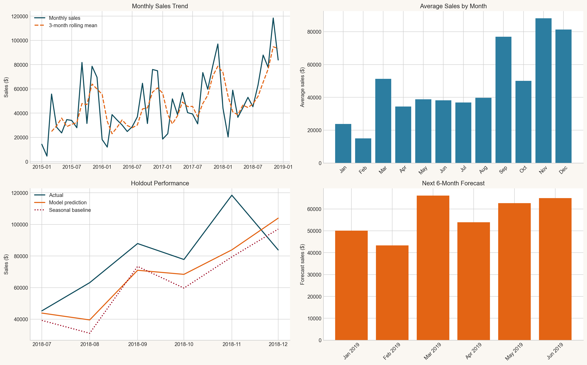
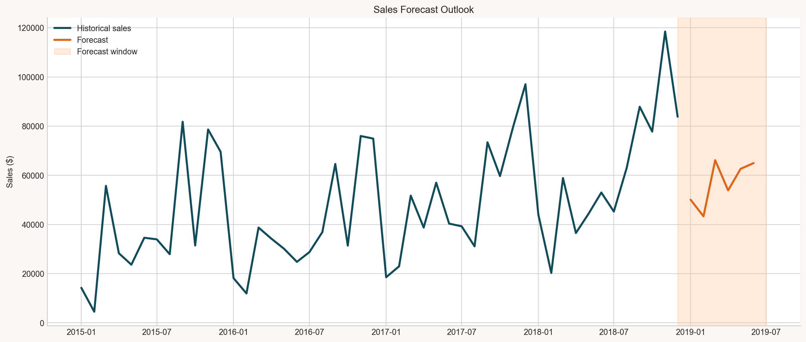

# Sales Demand Forecasting with Superstore Data

This project builds a beginner-friendly sales forecasting workflow using historical Superstore transactions. It cleans raw business data, creates time-based features, trains a forecasting model, evaluates errors on a holdout period, and turns the results into visuals a manager can understand quickly.

## Business Goal

The forecast helps a business answer practical planning questions:

- How much inventory should we buy for the next few months?
- When are sales likely to peak or slow down?
- How can finance and staffing teams prepare ahead of demand changes?

## Project Workflow

1. Clean raw sales records and remove unusable rows.
2. Aggregate transactions into monthly sales totals.
3. Engineer trend, lag, and seasonality features.
4. Train a regression-based forecasting model.
5. Evaluate forecast accuracy on the latest holdout months.
6. Generate future predictions and business-ready charts.

## Tech Stack

- Python
- Pandas
- NumPy
- Scikit-learn
- Matplotlib

## Dataset

- Source task dataset: [Superstore Sales Dataset](https://www.kaggle.com/datasets/vivek468/superstore-dataset-final)
- Included file: `data/raw/superstore.csv`
- The included CSV is a public mirror of the widely used Sample Superstore dataset so the project runs out of the box.

## Run It

```bash
python src/forecast_sales.py
```

Optional arguments:

```bash
python src/forecast_sales.py --forecast-horizon 6 --holdout-months 6
```

## Outputs

Running the script generates:

- `data/processed/monthly_sales.csv`
- `outputs/holdout_predictions.csv`
- `outputs/future_forecast.csv`
- `outputs/model_metrics.json`
- `outputs/forecast_summary.md`
- `outputs/forecast_dashboard.png`
- `outputs/sales_forecast_outlook.png`

## Results Snapshot

The current run uses monthly sales from January 2015 to December 2018 and reserves the final 6 months as a holdout test.

- Model: `Ridge` regression with trend, lag, and seasonality features
- Holdout MAE: `$17,657`
- Holdout RMSE: `$20,541`
- Holdout MAPE: `20.8%`
- Seasonal baseline MAE: `$20,460`
- Forecasted next 6 months total: `$340,964`
- Highest forecast month: `March 2019` at `$66,127`
- Lowest forecast month: `February 2019` at `$43,312`

### Forecast Table

| Month | Forecast Sales |
| --- | ---: |
| Jan 2019 | $50,075 |
| Feb 2019 | $43,312 |
| Mar 2019 | $66,127 |
| Apr 2019 | $53,881 |
| May 2019 | $62,623 |
| Jun 2019 | $64,946 |

## Business Interpretation

- Demand softens at the start of the forecast window and then rebounds strongly through March, May, and June.
- The model confirms strong year-end seasonality, with November and December historically standing out.
- A manager could use this forecast to buy leaner in February, then increase inventory and staffing ahead of March and the late-spring lift.

## Visuals





## Repository Structure

```text
.
|-- data
|   |-- processed
|   |-- raw
|       |-- superstore.csv
|-- outputs
|-- src
|   |-- forecast_sales.py
|-- README.md
|-- requirements.txt
```

## What to Present

Use the generated charts and summary to explain:

- what sales are expected to do next
- when demand is likely to be stronger or softer
- how inventory, cash flow, and staffing plans should respond
