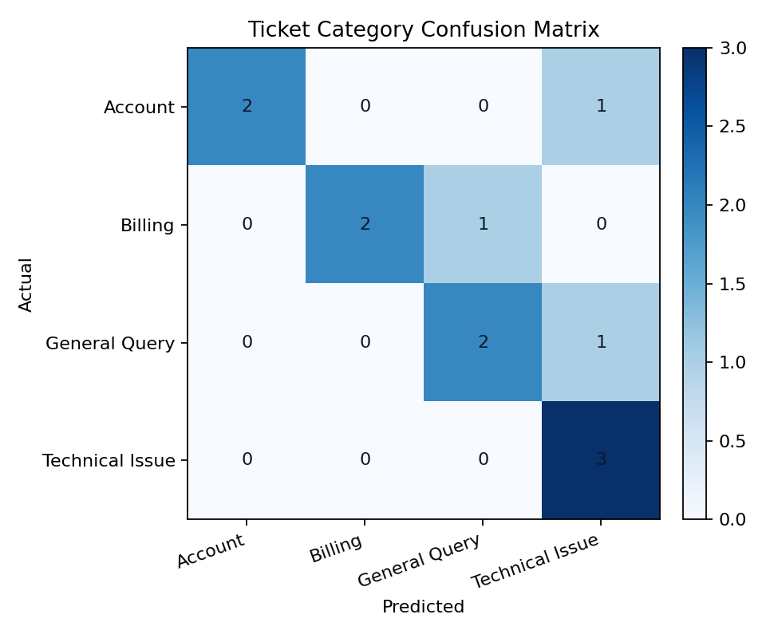
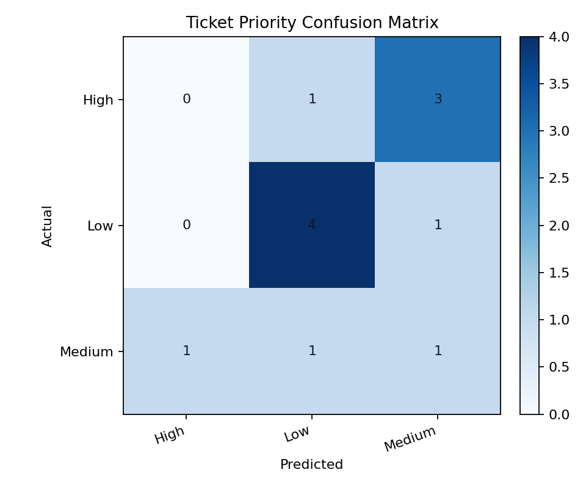

# Support Ticket Classification and Prioritization

This project builds a practical NLP pipeline for customer support operations. It reads text tickets, cleans the language, turns the text into TF-IDF features, predicts the ticket category, and predicts how urgent the ticket is.

## Business Problem

Support teams often lose time manually sorting tickets before they can solve them. This project helps with two decisions:

- `Category`: Where should the ticket go
- `Priority`: How fast should the team respond

## Categories

- Billing
- Technical Issue
- Account
- General Query

## Priorities

- High
- Medium
- Low

## Features Implemented

- Text cleaning with lowercasing, punctuation removal, and stopword filtering
- TF-IDF feature extraction
- Ticket category classification
- Priority prediction
- Evaluation with accuracy, precision, recall, and F1-score
- Confusion matrices for both tasks
- Example predictions for new tickets

## Dataset

The repository includes a small labeled sample dataset in `data/support_tickets.csv` so the project runs locally without extra downloads.

Suggested production-scale dataset:

- Kaggle: <https://www.kaggle.com/datasets/adisongoh/it-service-ticket-classification-dataset>

To use a larger dataset later, replace the sample CSV with the same columns:

- `ticket_id`
- `ticket_text`
- `category`
- `priority`

## Run

```bash
python src/train_ticket_models.py
```

## Outputs

Running the script generates:

- `models/category_model.joblib`
- `models/priority_model.joblib`
- `outputs/ticket_metrics.json`
- `outputs/category_confusion_matrix.csv`
- `outputs/category_confusion_matrix.png`
- `outputs/priority_confusion_matrix.csv`
- `outputs/priority_confusion_matrix.png`
- `outputs/sample_ticket_predictions.csv`
- `outputs/ticket_summary.md`

## Results Snapshot

The current sample run uses `48` labeled support tickets and produces:

- Category accuracy: `75.0%`
- Category weighted precision: `81.67%`
- Priority accuracy: `41.67%`
- Priority weighted precision: `32.78%`

The category model is already useful for first-pass ticket routing. The priority model is intentionally documented more cautiously because it needs a larger and richer historical dataset to become production-ready.

## Example Predictions

| Ticket Text | Predicted Category | Predicted Priority |
| --- | --- | --- |
| Users cannot log in after a password reset and the whole account team is blocked. | Account | High |
| Please send a copy of our April invoice and update the billing contact. | Billing | Low |
| How do I add a viewer role for our external auditor? | Account | Low |
| The dashboard is slow but still working for most users. | Technical Issue | Medium |

## Visuals

Category confusion matrix:



Priority confusion matrix:



## How It Works

1. Clean raw ticket text into normalized tokens.
2. Train one model to predict the category.
3. Train a second model to predict priority.
4. Save metrics and sample predictions for business review.

## Business Explanation

- Tickets are categorized based on keywords and patterns learned from historical ticket text.
- Priority is decided from the same text using urgency signals such as payment failures, outages, login blocks, deadlines, and general service impact.
- The system helps support managers reduce backlog and route high-impact tickets first.
